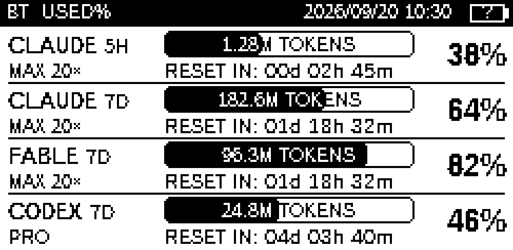

# Sweetmeter

A small Bluetooth e-paper dashboard for Claude Code and Codex subscription
usage. One screen shows Claude 5-hour, Claude weekly, Fable weekly and Codex
weekly quotas, reset countdowns and local Token totals.

面向 Claude Code / Codex 的蓝牙墨水屏额度仪表盘：四项额度同屏，电脑端读取数据，
ESP32 显示；首次使用需要配套程序和 USB 刷写，正常使用通过蓝牙传输。



*Illustrative data and subscription labels, rendered at 250 × 122 and enlarged
4×. This image is not a real account snapshot.*

## Hardware

The supported target is **ELECROW CrowPanel ESP32 Display-2.13(E), PCB V1.2,
JD79661**, with ESP32-S3, 8 MB flash, 8 MB PSRAM and a 2.13-inch black/white
e-paper panel. It has physical buttons and a rocker; it is not a touch screen.
Use a USB-C data cable for the first flash. A protected single-cell 3.7 V battery
and MAX17048 fuel gauge are optional.

See [hardware, pinout, battery connector and recovery](docs/HARDWARE.md) before
buying parts or flashing. Other panel sizes and SSD1680 revisions are not
compatible with this firmware image.

## How it works

The companion reads the current user's locally installed Claude Code/Codex
login and usage information, renders the dashboard, and sends a 4000-byte frame
through Bluetooth Low Energy. The device stores no account credentials and
does not access computer files directly. USB provides power, charging and
initial flashing; it is not the normal dashboard data connection.

- The main numbers and bar fill are **used quota percentages**.
- The left column shows the model/service, smaller `5H` or `7D` period, and
  the actual subscription label. Unknown labels remain `--`.
- Tokens sit inside the bar. `K`, `M`, `B` mean thousands, millions and billions.
- `RESET IN: 01d 18h 32m` means one day, eighteen hours and thirty-two whole
  minutes remain. Under one minute shows `<1m`; expired data shows `RESET:
  PENDING`, not a promise that a new quota has already been fetched.
- The date and `HH:mm` clock synchronize with the selected computer. Seconds
  are intentionally omitted to reduce e-paper refresh work.
- `BT` indicates the selected computer is connected. The battery icon shows
  `?` until a working gauge supplies a valid value. `!` marks stale data.
- Data normally refreshes every 60 seconds; the top button requests a refresh.
  Server rate-limit backoff still applies.

**Quota and Tokens are different measurements.** Quota percentages come from
the account's limits. Tokens count this computer's local logs within the quota
window; they are not a published account-wide Token allowance. Web usage,
other computers and unavailable cloud logs are not counted. Local logs are not
yet separated by signed-in account, so multiple accounts/API sessions can mix.
Claude weekly includes Fable tokens; rows must not be added together.

Claude counts input, output, cache creation and cache read. Codex counts input
and output; cached input/reasoning are already included and are not added twice.

## Buttons and power

| Control | Action |
| --- | --- |
| Top button, short press | Refresh; rescan while selecting a computer |
| Top button, hold 3 seconds | Show OFF, then sleep after release |
| Top button while asleep | Wake the device |
| Bottom button, hold 3 seconds | Open computer selection |
| Rocker up/down, then press | Choose and save a computer |
| Bottom button in selection | Back |

After a selected companion has connected in the current boot, a continuous
30-second disconnection puts the device into deep sleep. A valid reconnect
within that grace period cancels the timer. Deep sleep disables Bluetooth;
press the top button to wake before reconnecting. E-paper retains its OFF
screen without power. Button sleep does not electrically disconnect every
component on the development board.

## Installation status

This branch is being developed from the working macOS prototype. The baseline
has macOS CoreBluetooth transport; Windows/Linux transport, native packages,
signed update prompts and BLE OTA are being added. Do not treat the planned
features below as validated release behavior until a release's verification
record says so. There is no app signing/notarization claim for this baseline.

Development setup for the imported macOS baseline:

```sh
git clone https://github.com/luvxinc/Sweetmeter.git
cd Sweetmeter
python3 -m venv .venv
.venv/bin/python -m pip install -r requirements.txt
.venv/bin/python scripts/install_hooks.py
```

Log into the official Claude Code and Codex clients as the same OS user who
will run Sweetmeter. Do not paste account tokens into repository files. The
baseline reads Claude's existing login and calls its usage endpoint, and uses
the official local Codex `app-server` command for `account/rateLimits/read`.

For a fresh macOS prototype installation, Xcode Command Line Tools are required
to build the legacy helper:

```sh
.venv/bin/python scripts/install_agent.py
```

That installer uses `~/Library/Application Support/QuotaMeter`, keeps that
installation's own state on upgrades, and creates
`~/Library/LaunchAgents/com.sweetmeter.companion.plist`. It never copies caches,
logs or credentials from the source checkout. Permit Bluetooth access when
macOS requests it. Existing prototype installations need explicit migration;
do not start a second background companion alongside the first.

First firmware flash and private backup instructions are in
[HARDWARE.md](docs/HARDWARE.md). After flashing, open computer selection on the
device and choose the companion. A Bluetooth connection alone cannot read
account data: the companion must be running, and the official clients must be
logged in. Windows/Linux installation steps will accompany their native
packages; those platforms have not been physically tested in this baseline.

## Updates and release notes

The target flow is: the companion checks GitHub Releases, shows the signed
release notes, and offers **Install / Later / Skip this version**. Installation
begins only after the user selects Install. Firmware is downloaded and verified,
transferred over BLE to the inactive firmware slot, then booted and checked;
failed startup health checks trigger rollback. A USB bootstrap flash is needed
once to install the OTA-capable firmware. Keep USB power connected during
firmware upgrades until battery-side acceptance has been completed.

The build/acceptance sequence is tracked in
[IMPLEMENTATION_PLAN.md](docs/IMPLEMENTATION_PLAN.md). An available draft or
source commit is not a promise that its OTA path has passed hardware tests.

## Data and compatibility

Claude's OAuth usage endpoint is a client-facing internal API, not a stable
public API commitment. The Fable row uses its independently reported weekly
model limit; missing Fable data stays unknown and is never substituted with
Sonnet. The companion does not rewrite Claude login credentials. If a login
expires, sign in again through the official client.

The Codex weekly window is selected by its seven-day duration from the Codex
quota bucket. Subscription labels come from login/quota metadata, not example
values. API/log format changes may require adapter updates.

Local runtime state includes provider caches, Token indexes, device selection
and diagnostics. Treat it as private. Never commit `state/`, real screenshots,
full-flash backups, authentication files or release signing keys. Only the
deliberately synthetic example under `docs/assets/` is public test data.

## Development and version policy

```sh
python -m unittest discover -s tests -v
python scripts/render_example.py
python scripts/generate_screen_font.py
```

These tests and rendering commands use synthetic data. They do not contact real
accounts or the device. The hardware diagnostic scripts under `scripts/` are
separate, explicitly invoked tools and require the actual serial port and state
directory. They may reset or disconnect the device when requested.

Version format is **`YYYY.M.N`**, using the UTC year/month with no leading zero
on month or sequence. The first accepted commit in a month is `.1`; every
following commit adds one. A new month resets the sequence. For example:
`2026.9.1`, `2026.9.2`, then `2026.10.1`.

Every commit needs user-facing change notes. Install the repository hooks with
`python scripts/install_hooks.py`; hooks and CI validate the version/changelog
contract. Local hooks can be bypassed, so protected-branch CI is also required.
The reviewed `2026.9.1` foundation seeds main with the trusted policy. Later
changes go through an integration-branch pull request, where the trusted base
posts `version-policy/trusted` on the proposed head. After that status and all
required tests pass, fast-forward the exact checked head into protected main.
Do not create merge commits or squash merges; outside-reviewer approval is not
a required gate.
See [CONTRIBUTING.md](CONTRIBUTING.md) for the enforced workflow and
[CHANGELOG.md](CHANGELOG.md) for changes. A versioned commit and a published
firmware release are separate: release only after the required checks pass.

## License and acknowledgments

Original Sweetmeter code is under [Apache License 2.0](LICENSE). Third-party
components keep their own licenses. Bundled fonts and the generated device UI
font use SIL OFL 1.1. Arduino/ESP32 components have separate license obligations.

The display initialization and waveform values reference ELECROW's V1.2
example, whose repository-level license was not provided. Its permission scope
remains unresolved; vendor assets are not relabeled Apache-2.0. See
[THIRD_PARTY_NOTICES.md](THIRD_PARTY_NOTICES.md) for sources and notices,
including CodexBar, ccusage and CodexIsland. Sweetmeter is an independent
project, not an official product of the AI providers or ELECROW.
